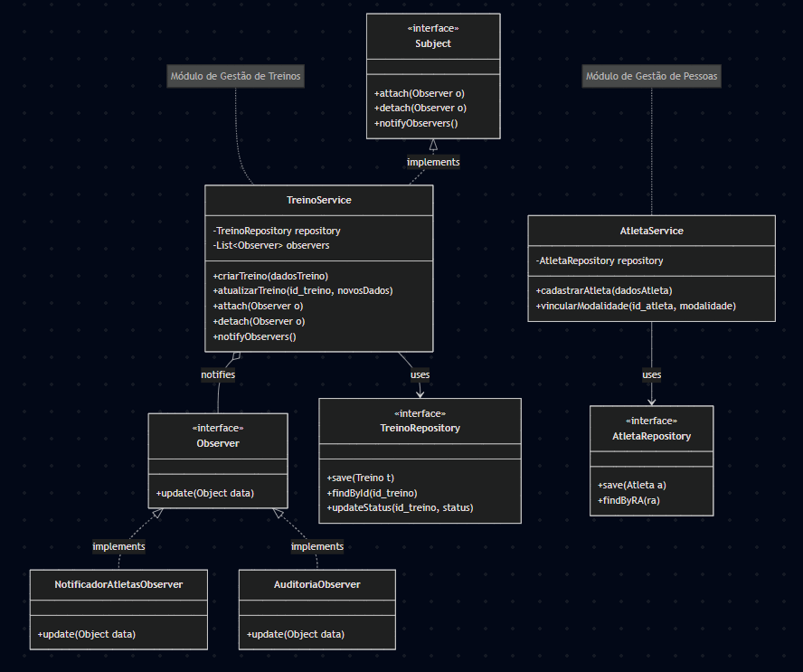

# Arquitetura — Sistema de Gerenciamento de Atlética

Arquitetura, componentes, padrões de projeto e trade-offs. Consolida a Sprint 2,
alinhada à implementação atual (aplicação de terminal em Python puro, entrada por
CSV e saída em relatório Markdown).

## 1. Visão geral

O sistema é uma aplicação de **terminal, sem interface gráfica e inteiramente em
Python**, organizada como **monolito modular** em camadas. Recebe dados
estruturados (CSV), aplica regras de negócio e produz uma saída estruturada
(relatório Markdown).

Camadas e fluxo:

```
CSV (data/forms ou data/mocks)
        │
        ▼
importador_csv  ──►  servicos (regras de negócio)  ──►  repositorios (memória)
        │                     │                                  │
   importador_html      eventos (Observer)                       │
   (leitura segura)            │                                  ▼
        └─────────────────────┴──────────────►  relatorio_md  ──►  relatório .md
```

A orquestração (CLI) fica em `app.py`, que compõe repositórios, serviços e
observadores na classe `Aplicacao`.

## 2. Componentes e responsabilidades

| Módulo | Responsabilidade |
| --- | --- |
| `modelos.py` | Entidades de domínio (`Atletica`, `Atleta`, `MembroAtletica`, `Treinador`, `Treino`, `Campeonato`) e `ResultadoOperacao` (saída padronizada). |
| `repositorios.py` | Persistência em memória (`RepositorioMemoria`, `BancoMemoria`) e checagem de duplicidade de CPF/RA. |
| `servicos.py` | Regras de negócio: validações de campos, integridade e datas. |
| `eventos.py` | Barramento de eventos (Observer) e caixa de notificações. |
| `importador_csv.py` | Lê os CSVs, resolve referências por chave natural e alimenta os serviços. |
| `importador_html.py` | Extrai dados da declaração de matrícula (HTML) usando só a biblioteca padrão. |
| `relatorio_md.py` | Gera o relatório Markdown a partir do estado da aplicação. |
| `app.py` | CLI e composição (`Aplicacao`): menu interativo e comando `processar-csv`. |

## 3. Padrões de projeto

Três padrões aplicados intencionalmente, com módulos/classes reais do código
(mínimo exigido: 2).

### 3.1. Service Layer — `servicos.py`
Isola as regras de negócio da orquestração e do acesso a dados. Classes
`AtleticaService`, `PessoaService`, `TreinoService` e `CampeonatoService`
encapsulam validações como duplicidade de CPF/RA, existência de referências e a
regra temporal de datas do campeonato.

### 3.2. Repository — `repositorios.py`
Abstrai o armazenamento. `RepositorioMemoria` oferece `adicionar`, `obter`,
`listar`, `atualizar` e `existe`; `BancoMemoria` agrupa os repositórios. Os
serviços não conhecem o mecanismo de persistência, o que permitiria trocar a
memória por um banco real sem alterar as regras de negócio.

### 3.3. Observer — `eventos.py`
Desacopla a notificação da lógica de atualização. `BarramentoEventos` publica o
evento `treino_atualizado`; `CaixaNotificacoes` (inscrita em `Aplicacao`) registra
a mensagem. Assim, atualizar um treino gera notificações sem que `TreinoService`
conheça o destino.

### Diagrama de classes



## 4. Padrões de codificação e qualidade

Seguindo as recomendações oficiais do Python (PEP 8/257/484):

- **Idioma:** código em PT-BR, alinhado aos nomes das entidades e colunas.
- **Nomenclatura:** `PascalCase` para classes/exceções; `snake_case` para
  funções, métodos e variáveis; `UPPER_SNAKE_CASE` para constantes.
- **Type hints (PEP 484):** obrigatórios nas assinaturas de serviços e funções.
- **Docstrings (PEP 257):** comentário no topo de cada arquivo descrevendo sua
  funcionalidade; docstrings em classes e funções públicas; comentários em linha
  apenas para lógica não trivial.
- **Commits (Conventional Commits):** `feat`, `fix`, `docs`, `refactor`, `test`,
  `chore`.
- **Branches (GitHub Flow):** `main` (estável), `develop` (integração),
  `feature/*` e `bugfix/*`.

## 5. Segurança no tratamento do HTML

A declaração de matrícula é referenciada pelo CSV e lida de forma contida em
`importador_csv._resolver_html_seguro`:

- rejeita caminhos absolutos e *path traversal* (`..`);
- só aceita arquivos dentro da pasta de dados;
- falha segura: se o arquivo não existir ou não puder ser lido, o cadastro segue
  com os dados do CSV e registra um alerta no relatório;
- o CSV é autoritativo — o HTML apenas preenche campos vazios.

## 6. Trade-offs

- **Armazenamento em memória (sem ORM/banco):** simplifica o protótipo e os testes
  (determinístico, sem I/O externo) ao custo de não persistir entre execuções. A
  camada Repository isola essa decisão, permitindo evolução futura.
- **CSV como entrada (em vez de JSON/API):** formato simples, próximo de
  "respostas de formulário" e fácil de produzir/editar; exige convenções claras
  para listas e referências por chave natural (documentadas no README dos CSVs).
- **Referência ao HTML por caminho (em vez de conteúdo embutido no CSV):** evita
  quebra de parsing, células enormes e risco de injeção, ao custo de exigir que os
  arquivos estejam na pasta de dados.
- **Saída em Markdown:** legível e versionável; não é um formato consultável como
  um banco, mas atende ao objetivo de relatório estruturado.
